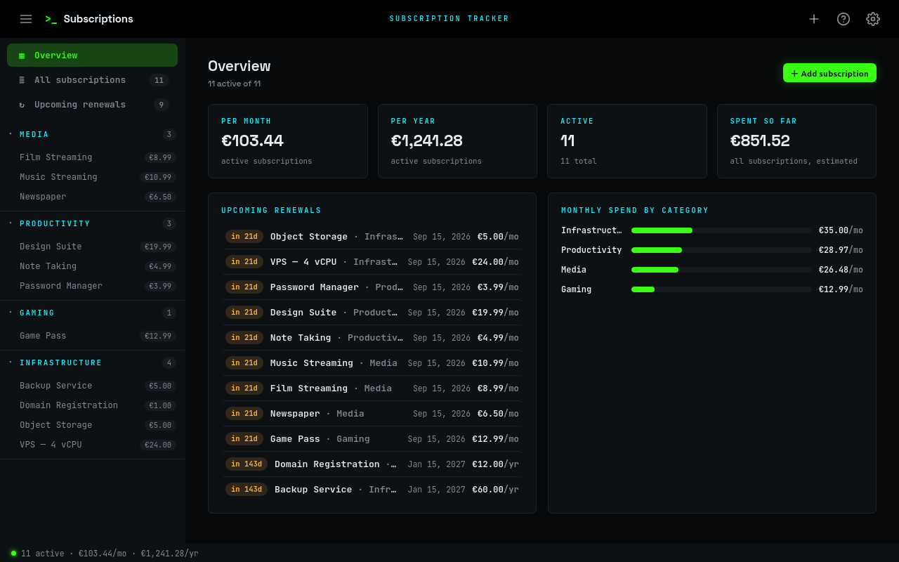

# Subscriptions



A small, self-hosted web app for tracking the subscriptions you pay for — what
they cost per month and per year, when they renew, and how much you've spent so
far. Runs in a single Docker container.

It shares the look and layout of the other apps in this collection: a left
sidebar that lists your subscriptions grouped by category, three themes (deep
blue, dark terminal, light), and an instant theme switcher.

## Quick start

```bash
docker compose up -d --build
```

Then open <http://localhost:8032>.

Data is stored in a Docker volume (`subscriptions-data`) as a SQLite database at
`/data/subscriptions.db`, so it survives rebuilds.

## What it tracks

Each subscription has:

| Field          | Notes                                                        |
| -------------- | ----------------------------------------------------------- |
| Name           | e.g. *Netflix Premium*                                      |
| Category       | Media / Productivity / Gaming — editable, add your own      |
| Billing cycle  | Monthly or yearly                                           |
| Amount         | The price **per cycle** — the only cost you enter           |
| Start date     | When you first subscribed                                   |
| Renew date     | Next renewal (auto-filled to start + one cycle if blank)    |

Everything else is **derived** from the billing cycle and the one amount, so the
figures can never disagree:

- **Monthly cost** and **yearly cost** — the two equivalents of your price.
- **Total spent so far** — estimated from the start date and cycle (how many
  times you've been billed × the amount).
- **Next renewal** — rolled forward so a past date still shows a live countdown.

## The interface

- **Sidebar** — *Overview*, *All subscriptions*, *Upcoming renewals*, then your
  categories, each expandable to the subscriptions inside it. A small warm dot
  marks anything renewing within a week.
- **Overview** — total monthly / yearly spend, active count, total spent, a list
  of upcoming renewals, and a per-category spend breakdown.
- **Detail view** — click any subscription for its full breakdown, then **Edit**
  or **Delete**.
- **Settings** — manage categories (deleting one moves its subscriptions to an
  *Uncategorized* bucket), pick a theme, set the currency symbol, export
  everything to JSON, or reset.

## Configuration

Environment variables (see `docker-compose.yml`):

| Variable        | Default | Purpose                                              |
| --------------- | ------- | ---------------------------------------------------- |
| `CURRENCY`      | `€`     | Display symbol shown next to amounts (no conversion) |
| `UPCOMING_DAYS` | `30`    | How many days ahead counts as an "upcoming" renewal  |
| `AUTH_USER`     | —       | Set with `AUTH_PASSWORD` to require HTTP Basic auth  |
| `AUTH_PASSWORD` | —       | Password for Basic auth                              |
| `PORT`          | `8080`  | In-container port (host port is mapped in compose)   |

The currency symbol can also be changed at runtime in **Settings → Preferences**.

## Development

Run it without Docker:

```bash
pip install -r requirements-dev.txt
DB_PATH=./data/subscriptions.db python app.py   # http://localhost:8080
```

Run the tests:

```bash
pip install -r requirements-dev.txt
python -m pytest
```

## Layout

```
app.py            Flask app + HTTP routes
config.py         env-derived settings + shared helpers (now_iso, today)
database.py       SQLite connection, schema, key/value settings
subscriptions.py  cost & renewal derivation (single source of truth)
templates/        base.html (shell: header, sidebar, modals) + app.html (views)
static/           style.css (theme tokens), icons, PWA manifest + service worker
tests/            pytest suite (unit + API)
```

## Security notes

- Open by default for localhost / trusted-LAN use. Set `AUTH_USER` +
  `AUTH_PASSWORD` to require a login.
- State-changing requests are rejected if they come from another origin (a
  lightweight CSRF guard).
- All user input is escaped in the browser and validated on the server.
